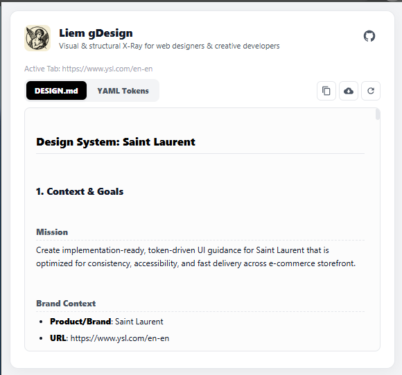
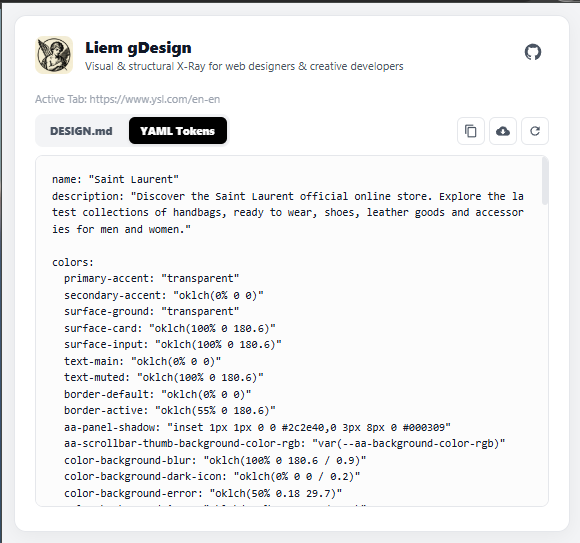
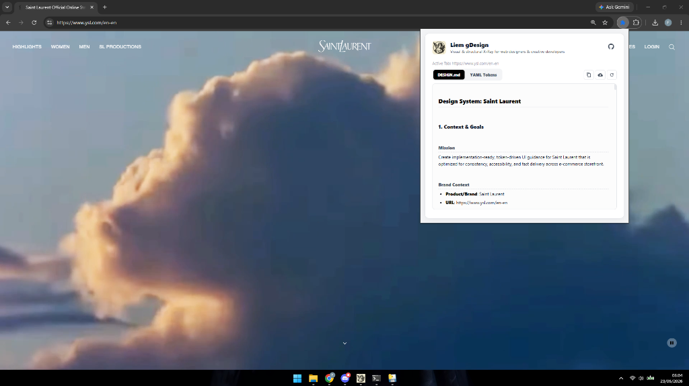

# Liem gDesign

> **Visual & Structural X-Ray for Web Designers & Creative Developers**

Liem gDesign is a lightweight, privacy-focused Chrome Extension that inspects the active browser tab to scrape its design foundations and automatically compile them into a unified, implementation-ready design system specification (`DESIGN.md`) and raw `YAML Tokens`.

---

## Previews

### Side-by-Side Tab System
| **DESIGN.md** Preview | **YAML Tokens** Preview |
| :---: | :---: |
|  |  |

### Liem gDesign in Action


---

## Key Features

* **Design DNA Extraction**: Instantly extracts core variables from any live website:
  * **Color Palette**: Automatically maps active styles to readable CSS/OKLCH color tokens.
  * **Typography Scale**: Scrapes display, headlines, titles, and body sizes, families, and weights.
  * **Spacing & Corners**: Infers layout spacing scales and border radius rules.
  * **Component Anatomy**: Scrapes button, input, and card structures, generating matching interaction and state matrices (default, hover, active, focus-visible, disabled, loading, and error).
* **Double-Tab System View**:
  * **DESIGN.md Tab**: View the formatted markdown design system document, fully parsed and rendered to clean HTML.
  * **YAML Tokens Tab**: View the machine-readable YAML frontmatter block for instant token integration.
* **Small, Modern Action Toolbar**: One-click actions to Copy or Download the complete `DESIGN.md` specification (combining both YAML and markdown body), or Re-scan/Refresh the page.
* **100% Local & Private**: No external servers, API keys, or databases required. All operations run directly in your local browser sandbox.

---

## How to Install Locally (Developer Mode)

To run this extension on your machine:

1. Clone or download this repository.
2. Open Google Chrome and navigate to **`chrome://extensions/`**.
3. Enable **Developer mode** by toggling the switch in the top-right corner.
4. Click **"Load unpacked"** in the top-left.
5. Select the root folder of this project (which contains `manifest.json`, `popup.html`, `popup.js`, etc.).
6. Pin **Liem gDesign** to your Chrome toolbar and start scanning!

---

## How to Publish to the Chrome Web Store

1. Select all core files in the project folder (excluding `.git` and `.gitignore`):
   * `manifest.json`, `popup.html`, `popup.css`, `popup.js`, `background.js`, and `icon.png`.
2. Compress them into a single `.zip` file (e.g., `liem-gdesign.zip`).
3. Visit the [Chrome Web Store Developer Console](https://chrome.google.com/webstore/devconsole).
4. Register as a Chrome developer (requires a one-time $5 USD fee).
5. Click **"New Item"**, upload your `.zip` file, and fill in your store listing details (description, screenshots, and category).
6. Submit for review! (Typically approved within 1–3 business days).

---

## File Structure

```bash
Liem gDesign/
├── manifest.json      # Extension metadata, permissions & background scripts declaration
├── popup.html         # Tab navigation and UI markup
├── popup.css          # Sleek, minimal light-mode stylesheet
├── popup.js           # Page scraper script, markdown parser & tab switcher logic
├── background.js      # Background service worker
├── icon.png           # Extension logo
└── README.md          # Project documentation
```

---

## Privacy & Permissions

This extension respects your privacy:
* **`activeTab`**: Used only to access styling properties of the page you actively click on.
* **`scripting`**: Injets a script into the page to extract computed styles and CSS variables.
* **`clipboardWrite`**: Used to copy the generated design spec to your clipboard.
* **No Tracking**: No analytics, trackers, or cookies. Zero data leaves your computer.

---

## License

Distributed under the MIT License. See `LICENSE` for more information.
